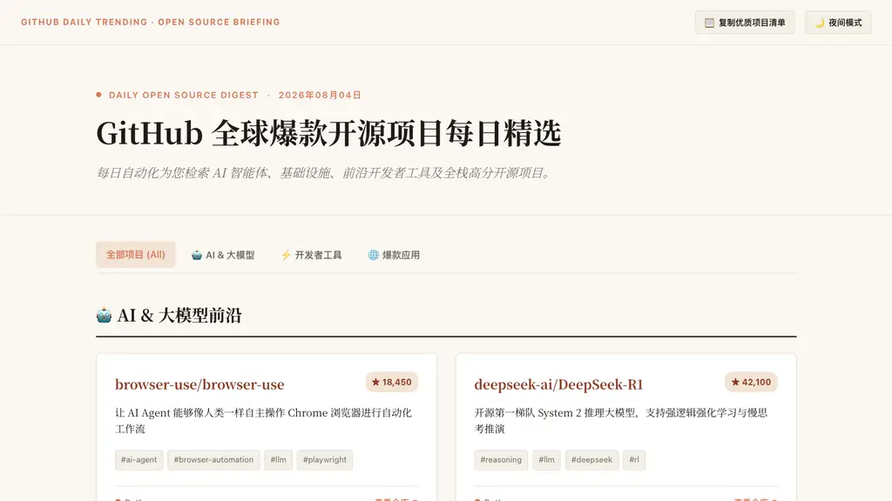
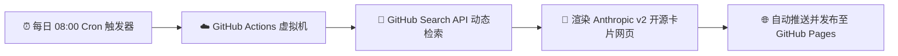

<div align="center">

# 🔥 GitHub 全球爆款开源项目每日精选

<p align="center">
  <b>每日自动化检索 AI 智能体、基础设施、前沿开发者工具及全栈高分开源项目</b>
</p>

[](https://github.com/chenzh659/github-daily-trending/actions/workflows/daily_trending.yml)
[](https://chenzh659.github.io/github-daily-trending/)
[](https://chenzh659.github.io/github-daily-trending/)
[](https://www.python.org/)
[](LICENSE)

<br />

[🌐 在线即刻阅读网页版](https://chenzh659.github.io/github-daily-trending/) · [💬 提交建议/Issue](https://github.com/chenzh659/github-daily-trending/issues)

</div>

---

## 🖼️ 页面效果预览 (Live Preview)

下图为每日自动化生成的 **Anthropic 暖沙衬线社论风格** 开源项目精选控制台：

<div align="center">
  
</div>

---

## ✨ 核心亮点

- 🎨 **Anthropic 品牌级美学**：采用暖沙色纸质背景（`#FAF7F2`）、赤陶珊瑚红（`#D97757`）与经典衬线字体（Noto Serif SC / Merriweather）。
- 🌓 **Anthropic Daylight / Dusk 双主题**：支持在**日光暖沙**与**夜间深炭**模式无缝平滑切换。
- 📊 **精选分类与指标展示**：
  - 🤖 **AI & 大模型前沿**（Agent 自动化、推理框架、LLM 辅助工具等）
  - ⚡ **开发者利器 & 基础设施**（Rust/Go 极速工具、命令行利器、代码重构 AST 工具）
  - 🌐 **爆款应用 & 全栈开源**（高分开源 Web 应用、画布协作工具、生产力软件）
- ⚙️ **完全无感云端运行**：基于 GitHub Actions 每天北京时间**早 8:00** 自动检索并同步发布至 GitHub Pages。

---

## 🔄 系统运行架构 (Architecture)



---

## 📁 目录结构

```text
github-daily-trending/
├── .github/
│   └── workflows/
│       └── daily_trending.yml     # ⏰ 定时任务工作流 (每天早 8:00)
├── generate_trending_report.py    # 🐍 自动检索与 HTML 渲染主脚本
├── index.html                     # 🌐 当前最新精选主页
├── assets/
│   └── preview.png                # 🖼️ README 预览截图
├── reports/                       # 📂 历史精选档案馆
│   └── 2026-08-04.html
└── README.md
```

---

<div align="center">
  <sub>Stay hungry, stay foolish. Explore open source every single day.</sub>
</div>
